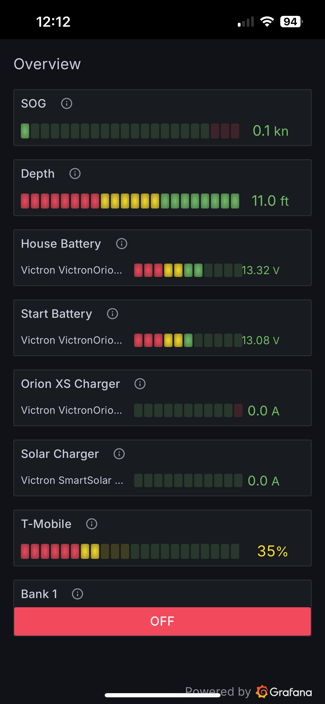

# SignalK Peplink Monitor



A SignalK plugin that monitors Peplink router WAN connections and provides cellular signal quality scale.

## Features

- Monitor multiple WAN connections (Cellular, Ethernet, WiFi)
- Real-time cellular signal quality calculation based on RSSI, SINR, RSRP, and RSRQ
- Configurable polling intervals
- Support for multiple cellular carriers
- Network statistics tracking (TX/RX packets and bytes)
- Signal strength metrics for marine internet connectivity

## Installation

### From SignalK App Store (Recommended)

1. Open your SignalK admin interface
2. Navigate to App Store
3. Search for "peplink-monitor"
4. Click Install
5. Activate SSH access on your Peplink Router
6. Set port ssh port to 22 on your Peplink

### Manual Installation

1. SSH to your SignalK server
2. Navigate to the SignalK plugins directory
3. Clone this repository:

   ```bash
   git clone https://github.com/wmbutler/signalk-peplink-monitor.git
   cd signalk-peplink-monitor
   npm install
   ```

## Prerequisites

- SignalK server running on Linux/Raspberry Pi
- SSH access to your Peplink router
- Peplink router with "get wan" command support

**No additional system dependencies required!** The plugin uses pure Node.js libraries.

## Configuration

Configure the plugin through the SignalK admin interface:

### Required Settings

- **Router IP Address**: IP address of your Peplink router
- **Password**: SSH password for router access
- **Connection Name**: Name you assigned to the Cellular WAN connection to monitor (e.g., T-Mobile, Verizon)

### Optional Settings

- **SSH Port**: SSH port (default: 22)
- **Username**: SSH username (default: admin)
- **Connection Name**: Name you assigned to the cellular WAN connection to monitor (e.g., T-Mobile, Verizon)
- **Poll Interval**: How often to check status in seconds (default: 30, minimum: 10)
- **Enabled Connections**: Array of connection types to monitor (default: ["Cellular", "Ethernet"])

## SignalK Data Path

The plugin currently publishes data to the following SignalK path:

- `communication.cellular.signalQuality` - Signal quality (0.0-1.0)


## Signal Quality Calculation

The plugin calculates cellular signal quality as a weighted percentage based on:

- **RSRP (35%)**: Reference Signal Received Power - most important for coverage
- **SINR (35%)**: Signal to Interference plus Noise Ratio - most important for data quality
- **RSSI (20%)**: Received Signal Strength Indicator - general signal strength
- **RSRQ (10%)**: Reference Signal Received Quality - signal quality indicator

### Quality Ranges

- **90-100%**: Excellent signal
- **70-89%**: Good signal
- **50-69%**: Fair signal
- **30-49%**: Poor signal
- **0-29%**: Very poor signal

## Troubleshooting

### Common Issues

1. **SSH connection fails**
   - Verify router IP address and credentials
   - Check that SSH is enabled on the router
   - Ensure firewall allows SSH connections
   - Try connecting manually: `ssh admin@192.168.50.1`

2. **No data appearing**
   - Check SignalK debug logs for error messages
   - Verify the connection name matches exactly (case-sensitive)
   - Ensure the router supports the "get wan" command

3. **Connection timeout errors**
   - Increase poll interval to reduce load
   - Check network stability between SignalK server and router
   - Verify router is not overloaded with connections

### Debug Mode

Enable debug logging in SignalK settings to see detailed plugin operation:

- Set log level to "debug"
- Look for "Peplink Monitor" messages in the logs

## Compatible Routers

The peplink router must support:

- Cellular connectivity
- SSH access
- "get wan" command that returns structured WAN connection data

## Contributing

1. Fork the repository
2. Create a feature branch
3. Make your changes
4. Add tests if applicable
5. Submit a pull request

## License

MIT License - see LICENSE file for details

## Support

For issues and questions:

- Create an issue on GitHub
- Post in the SignalK community forums
- Contact the author

## Marine Use Case

This plugin is particularly useful for:

- Remote monitoring of vessel connectivity status across cellular connections.
